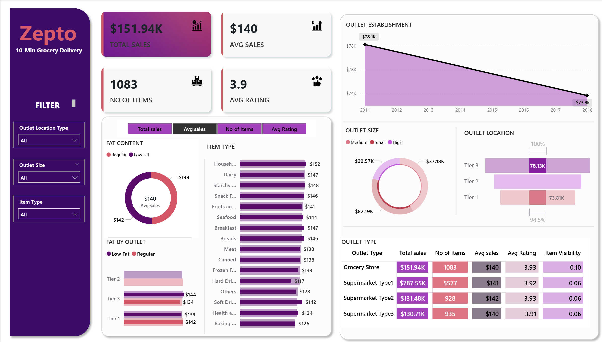

📊 Zepto Sales Performance Analytics Dashboard
Power BI • Data Cleaning • DAX • Business Insights

(Replace with your screenshot file)

🚀 Project Overview

This project showcases a fully interactive Power BI Dashboard analyzing the sales performance of Zepto – 10-Min Grocery Delivery.
It provides insights into total sales, outlet performance, customer ratings, item type analysis, outlet size, and location trends.

The dashboard is designed for quick decision-making, clean visual storytelling, and accurate KPI reporting.

🎯 Objectives of the Project

Transform raw sales data into a meaningful analytical report

Build an interactive dashboard with dynamic filters

Create accurate KPIs for business performance tracking

Visualize patterns across outlets, items, and customer behavior

📈 Key Metrics & Insights

Total Sales: $151.94K

Average Sales: $140

Total Items: 1083

Average Rating: 3.9

Top Performing Outlets: Grocery Store & Supermarket Type 1

Best Performing Item Categories: Household, Dairy, Snack Foods

Tier 3 shows the highest revenue contribution

🛠️ Tools & Technologies Used

Power BI (Dashboard Design & DAX)

Power Query (Data Cleaning & Transformation)

Excel (Pre-processing)

Data Modeling (Star Schema)

🗂️ Workflow Summary
1️⃣ Data Cleaning & Preparation

Removed duplicates & empty values

Standardized category fields

Corrected data formats (date, text, numerics)

2️⃣ Data Modeling

Designed Fact & Dimension tables

Built relationships for efficient filtering

3️⃣ KPI Development (DAX)

Total Sales

Average Sales

Number of Items

Average Rating

Outlet-level performance metrics

4️⃣ Dashboard Development

Includes:

Donut charts

Bar charts

Line charts

Stacked column charts

Matrix table

Interactive slicers

📸 Dashboard Preview

(Add your image here in GitHub)

⭐ Features of This Dashboard

Clean and intuitive UI

Business-ready KPIs

Dynamic filters (Outlet type, size, location, item category)

Trend analysis for outlet establishment year

Category-level sales insights

Comparative analysis by outlet type

📘 SOP Followed in This Project

Import dataset into Power BI

Clean & transform using Power Query

Develop KPIs using DAX

Build visuals with consistent theme

Validate metrics for accuracy

Publish final dashboard

📦 Project Files

PowerBI File (.pbix)

zepto Dataset (.csv / .xlsx)

Dashboard (.png)

README.md

💡 What I Learned

Creating structured KPIs using DAX

Improving storytelling through visual design

Ensuring data accuracy with detailed cleaning

Designing dashboards optimized for business users

🙌 About Me

Your Name
Aspiring Data Analyst | Power BI Developer | HR Analytics Enthusiast

🔗 LinkedIn: [LinkedIn](https://www.linkedin.com/in/priya-sharma5/)
📧 Email: priya2021csds122@abesit.edu.in